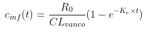

## Vancomycin pharmacokinetic review <font size = "2" >*by Kurt Pessa*</font>
<table>
    <tr>
        <th width="70%">
            <p>
                
            </p>
            <div align="left" style="font-size:16px;font-weight:normal" font-family:courier>
                <ul>
                    <li>in Python using a jupyter notebook and matplotlib </li>
                </ul>
            </div>
        </th>
        <th> 
            
        </th>
    </tr>
</table>

 
           


<table>


## I. General Equation 

<blockquote>

</blockquote>

1. `c_inf(t)`: If infusing, use infusion equation
2. `c_elim(t)` Else, use first-order elimination equation

<details><summary>Latex Syntax</summary>
<blockquote>
    
```
concentration(t) = \begin{bmatrix}
t_{inf,start} < t <= t_{inf,end} & c_{inf}(t)\\ 
else & c_{elim}(t) 
\end{bmatrix} \:\:\:\:\:\:\:\:   [1] 
```
    
</blockquote></details>
    
<details><summary>Python Code</summary>

<blockquote>
    
**In Python:**
```python
def concentration(t):
    if t_inf_start < t <= t_inf_end:
        return c_inf(t)
    else:
        return c_post(t)
```

</blockquote></details>
                              
### a.) Infusion Equation

First, we need to get the equation for concentration while infusing

- The concentration while infusing at time t, `c_inf(t)` is: 

    

<details><summary>Python Code</summary>

**In Python:**

<blockquote>
    
```
def c_inf(t):
    return R_0 / CL_vanco * (1 - math.exp(-K_e * t))
```
    
</blockquote></details>

### b.) Elimination Equation

- After infusing, now, we need to start using an elimination equation.  Here's the 1st-order elimination equation.

    


### Random PK Variables

```
Dose = 1000 # mgs
t_inf = 1 # hrs
K_e = 0.100 
V_d = 50 # L
```


