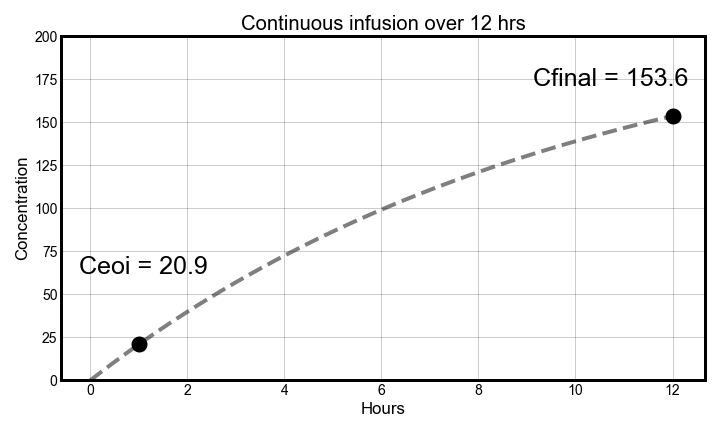

## Vancomycin pharmacokinetic review <font size = "2" >*by Kurt Pessa, MS, PharmD*</font>
<table>
    <tr>
        <th width="70%">
            <p>
                
            </p>
            <div align="left" style="font-size:16px;font-weight:normal" font-family:courier>
                <ul>
                    <li>in Python using a jupyter notebook and matplotlib </li>
                </ul>
            </div>
        </th>
        <th> 
            
        </th>
    </tr>
</table>


**External Links**
1. ASHP, IDSA, PIDSA 2020 Joint guidelines <a src=https://academic.oup.com/ajhp/article/77/11/835/5810200>&rarr; <ins>Link to journal article</ins> &larr;</a>
2. RxKinetics: <http://www.rxkinetics.com/vanmodel.html>
3. Vancopk: <https://www.vancopk.com/vanco-kinetics-review/>
4. Clinical Pharmacokinetics, 6th Edition <a src="https://store.ashp.org/Default.aspx?TabID=251&productId=514496146">&rarr; <ins>ASHP store link</ins> &larr;</a>


<details><summarY>Setting up python</summarY><blockquote>

<details><summary>Python Dependencies</summary>
<blockquote>

```python
import math
import numpy as np
import matplotlib.pyplot as plt
```

</blockquote>

</details>

<details><summary>Declaring Random PK Parameters</summary>
<blockquote>

```python
Dose = 1000 # mgs
t_inf = 1 # hrs
K_e = 0.100  ~ t1_2 = 6.9 hrs 
# Ke of 0.100 ~ 105 mL/min CrCl using 1985 Matze eqn
V_d = 45.5 # L ~ 70 kg * 0.65 L/kg
tau = 12
```

</blockquote>

</details>
    
</blockquote></details>

## I. General Equation 

<blockquote>
</blockquote>

1. `c_inf(t)` &rArr;  If infusing, use infusion equation
2. `c_elim(t)` &rArr; Else, use first-order elimination equation

    
<details><summary>Python Code</summary>

<blockquote>
    
```python
# General concentration equation
def concentration(t):
    if t_inf_start < t <= t_inf_end:
        return c_inf(t)
    else:
        return c_post(t)
```

</blockquote>

<details><summary>Latex Syntax</summary>
<blockquote>
    
```latex
concentration(t) = \begin{bmatrix}
t_{inf,start} < t <= t_{inf,end} 
& c_{inf}(t)\\ 
else 
& c_{elim}(t) 
\end{bmatrix} 
[1] 
```
</blockquote></details>

</details>
                              
### a.) Infusion Equation

First, we need to get the equation for concentration while infusing

- The concentration while infusing at time t, `c_inf(t)` is: 

<blockquote>
</blockquote>
        
<details><summary>Python Code</summary>

**In Python:**

<blockquote>
    
```python
# Infusion Equation
def c_inf(t):
    return R_0 / CL_vanco * (1 - math.exp(-K_e * t))
```
</blockquote>
    
<details><summary>Latex syntax</summary>
<blockquote>
    
c_{inf}(t) = \frac{R_0}{CL_{vanco}}(1 - e^{-K_e * t}) [2]</blockquote></details>
    
</details>
    

    
### b.) Elimination Equation

- After infusing, now, we need to start using an elimination equation.  Here's the 1st-order elimination equation.

<blockquote>
</blockquote>


